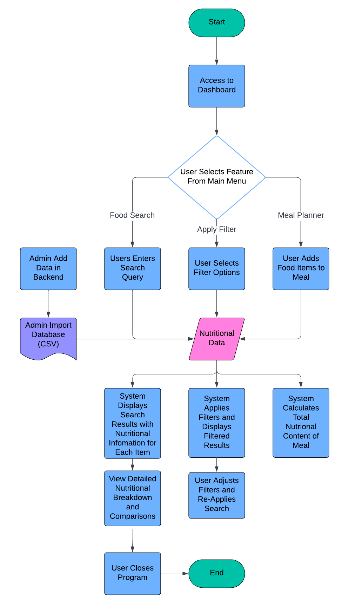
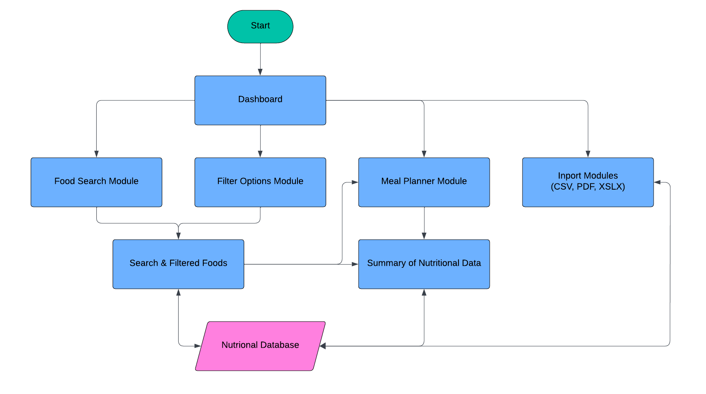
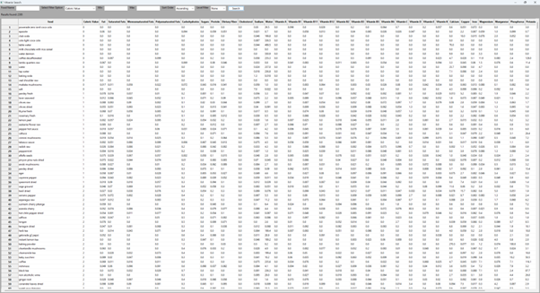
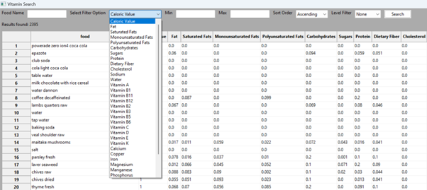
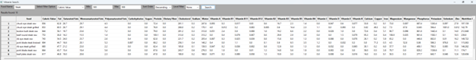
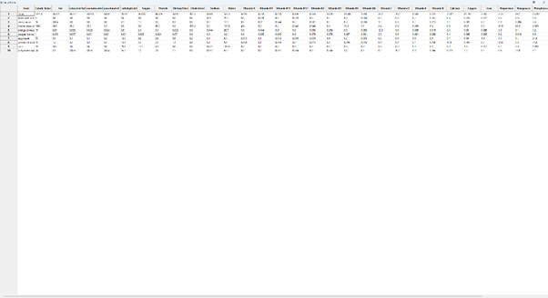

# Software Design Document

## Project Name: Data Analysis and Visualisation 
**Group Number:** 015

## Team Members
| Student No. | Full Name       |
|-------------|------------------|
| s5387195    | Ethan Davis      |
| s5347877    | Tristan Martins   |
| s5294045    | Ethan Baker      |

## Table of Contents
1. [System Vision](#system-vision)
   - [Problem Background](#problem-background)
   - [System capabilities/overview](#system-capabilitiesoverview)
   - [Potential Benefits](#potential-benefits)
2. [Requirements](#requirements)
   - [User Requirements](#user-requirements)
   - [Software Requirements](#software-requirements)
   - [Use Case Diagrams](#use-case-diagrams)
   - [Use Cases](#use-cases)
3. [Software Design and System Components](#software-design-and-system-components)
   - [Software Design](#software-design)
   - [System Components](#system-components)
     - [Functions](#functions)
     - [Data Structures / Data Sources](#data-structures--data-sources)
     - [Detailed Design](#detailed-design)
4. [User Interface Design](#user-interface-design)
   - [Structural Design](#structural-design)
   - [Visual Design](#visual-design)

## 1. System Vision

### 1.1 Problem Background

#### 1.1.1 Problem Identification: What problem does this system solve?

The 'Nutritional Food Comparison' system, including its features like Food Search, Nutrition Breakdown, Nutrition Range Filter, Nutrition Level Filter, and the additional Meal Planner feature, aims to solve the following problems:
1. **Complexity in Nutritional Data Analysis:** Nutritional information can be overwhelming and difficult to interpret manually. The system simplifies this process by providing tools that enable users to search for foods, analyze their nutritional content, and create personalized labels.
2. **Inaccessible Visualization:** The system makes nutritional data more accessible by incorporating simple visual elements like pie charts, bar graphs, and detailed nutritional breakdowns.
3. **Efficient Decision-Making:** Tools such as the system's filtering and range selection allow users to quickly make informed food choices based on nutritional content and dietary requirements.
4. **Personalized Meal Planning:** The Meal Planner feature, a unique and valuable component of the 'Nutritional Food Comparison' system, encourages users to create balanced meals by combining foods and analyzing their nutritional value. This aids in achieving dietary goals such as weight management or nutrient intake optimization.
5. **Time and Effort Reduction:** The system automates analyzing and comparing nutritional data, reducing the time and effort required to plan meals and make healthy food choices.

#### 1.1.2 Dataset: What is the dataset used?

The Nutritional Food Database provides a comprehensive dataset showing detailed nutritional information for various food items. Each food item in the dataset is analyzed based on various nutritional parameters, making it a valuable resource for dietary and health inquiries. The column descriptions that are used in the dataset are listed below:

| Dataset                                       | Description                                                                                          |
|-----------------------------------------------|------------------------------------------------------------------------------------------------------|
| Food                                          | The name or type of the food item.                                                                  |
| Caloric Value (in kcal)                      | Total energy provided by the food, typically measured in kilocalories per 100 grams.                |
| Fat (in g)                                   | Total amount of fats in grams per 100 grams, including the breakdowns that follow.                  |
| Saturated Fats (in g)                        | Amount of saturated fats (which can raise cholesterol levels) in grams per 100 grams.               |
| Monounsaturated Fats (in g)                  | Amount of monounsaturated fats (considered heart-healthy fats) in grams per 100 grams.              |
| Polyunsaturated Fats (in g)                  | Amount of polyunsaturated fats (essential fats needed by the body) in grams per 100 grams.          |
| Carbohydrates (in g)                         | Total carbohydrates in grams per 100 grams, including sugars.                                       |
| Sugars (in g)                                | Total sugars in grams per 100 grams, a subset of carbohydrates.                                     |
| Protein (in g)                               | Total proteins in grams per 100 grams, essential for body repair and growth.                        |
| Dietary Fiber (in g)                          | Fiber content in grams per 100 grams, important for digestive health.                               |
| Cholesterol (in mg)                          | Cholesterol content in milligrams per 100 grams, pertinent for cardiovascular health.               |
| Sodium (in g)                                 | Sodium content in milligrams per 100 grams, crucial for fluid balance and nerve function.           |
| Water (in g)                                  | Water content in grams per 100 grams, which affects the food’s energy density.                     |
| Vitamin A (in µg)                            | Amount of Vitamin A in micrograms per 100 grams, important for vision and immune functioning.      |
| Vitamin B1 (Thiamine) (in mg)                | Essential for glucose metabolism.                                                                    |
| Vitamin B11 (Folic Acid) (in mg)             | Crucial for cell function and tissue growth, particularly important in pregnancy.                    |
| Vitamin B12 (in µg)                           | Important for brain function and blood formation.                                                    |
| Vitamin B2 (Riboflavin) (in mg)              | Necessary for energy production, cell function, and fat metabolism.                                  |
| Vitamin B3 (Niacin) (in mg)                  | Supports digestive system, skin, and nerve health.                                                  |
| Vitamin B5 (Pantothenic Acid) (in mg)        | Necessary for making blood cells and helps convert food into energy.                                 |
| Vitamin B6 (in mg)                           | Important for normal brain development and maintaining the nervous and immune systems.               |
| Vitamin C (in mg)                            | Important for the repair of all body tissues.                                                       |
| Vitamin D (in µg)                            | Crucial for the absorption of calcium, promoting bone growth and health.                             |
| Vitamin E (in mg)                            | Acts as an antioxidant, helping to protect cells from damage caused by free radicals.                |
| Vitamin K (in µg)                            | Necessary for blood clotting and bone health.                                                       |
| Calcium (in mg)                              | Vital for building and maintaining strong bones and teeth.                                          |
| Copper (in mg)                               | Helps with the formation of collagen, increases iron absorption, and plays a role in energy production.|
| Iron (in mg)                                 | Essential for the creation of red blood cells.                                                     |
| Magnesium (in mg)                            | Important for regulating muscle and nerve function, blood sugar levels, and blood pressure.          |
| Manganese (in mg)                            | Involved in bone formation, blood clotting, and metabolism of fats and carbohydrates.               |
| Phosphorus (in mg)                           | Helps with the formation of bones and teeth and is necessary for cell growth and repair.            |
| Potassium (in mg)                            | Helps regulate fluid balance, muscle contractions, and nerve signals.                                |
| Selenium (in µg)                             | Important for reproduction, thyroid function, DNA production, and protecting the body from free radicals.|
| Zinc (in mg)                                 | Necessary for immune function, cell division, growth, wound healing, and carbohydrate breakdown.      |
| Nutrition Density                             | A metric indicating the nutrient richness of the food per calorie.                                   |

#### 1.1.3 Data Input/Output: What kind of data input and output is required?

Ensuring that both input and output mechanisms are intuitive and robust will enhance the user experience and accuracy of the 'Nutritional Food Comparison' project. The data input and output requirements are essential for the functionality and usability of the application. Below is a detailed breakdown:

**Data Input**
- **User Input for Food Search:**
  - **Search Queries:** This is text-based input where users can search for food items by name. This might include partial names or exact matches.
  - **Filters:** Criteria for filtering data, such as:
    - **Nutritional Ranges:** Users can select one of the nutrition and input minimum and maximum values, and the tool will display a list of foods that fall within those ranges.
    - **Nutritional Levels:** Users can filter foods by their nutritional content levels—low, mid, and high—including fat, protein, carbohydrates, sugar, and nutritional density.
      - **Low:** Less than 33% of the highest value.
      - **Mid:** Between 33% and 66% of the highest value.
      - **High:** Greater than 66% of the highest value.
  - **Upload and Integration:**
    - **CSV File Upload:** This option allows administrators to upload a CSV file containing nutritional data, which the system must parse and integrate into the database.

**Data Output**
- **Search Results:**
  - **List of Food Items:** Display search results based on the user's query, including relevant nutritional information.
  - **Detailed Information:** Provide detailed nutritional data for each food item, such as calories, fat content, vitamins, etc.
- **Nutritional Breakdown:**
  - **Tables:** Detailed tables showing the nutritional breakdown of selected food items.
  - **Graphs and Charts:** Visual representations like bar charts, pie charts, or line graphs to illustrate comparisons between different foods or nutrient levels.
  - **Comparison Tables:** Allow users to compare nutritional values of multiple food items side by side.
  - **Summary Statistics:** Provide summary statistics or insights based on user queries, such as average calories, highest protein content, etc.
- **User Interface (UI):**
  - **Interactive Grid:** Users can interact with a grid of food items, where clicking on an item will open a new window with more information.
  - **Meal Planner Output:** Based on user-selected food items, provide a summary of selected meals, total nutritional values, and options for saving or printing meal plans.

### 1.2 System capabilities/overview

The 'Nutritional Food Comparison' system is designed to facilitate users' understanding of food nutrition, enabling them to make informed dietary choices. It is an interactive tool that offers a range of capabilities:

1. **Food Search Functionality:** Users can search for food items by name, ingredient, or type.
2. **Nutritional Analysis:** Provides detailed nutritional breakdowns for each food item, including calories, fats, proteins, carbohydrates, vitamins, and minerals.
3. **Filtering Mechanism:** Users can filter food items based on nutritional values, allowing them to find options that fit their dietary preferences or restrictions.
4. **Data Visualization:** Generates visual representations of nutritional data, including charts and graphs, to help users easily comprehend comparisons between different food items.
5. **Meal Planning Tool:** A unique feature that allows users to combine food items and plan meals while analyzing their nutritional content.
6. **CSV File Import:** Enables administrators to add or update food data in bulk, ensuring the database is always current.

### 1.3 Potential Benefits

The system aims to offer several benefits to its users:

1. **Improved Dietary Choices:** Users can make more informed decisions about their food intake, leading to healthier eating habits.
2. **Enhanced Nutritional Awareness:** By visualizing nutritional data, users gain a better understanding of the nutritional profiles of various foods.
3. **Personalized Nutrition Planning:** The Meal Planner feature empowers users to customize their meals according to their dietary needs, goals, and preferences.
4. **Time Efficiency:** The system streamlines the process of searching for and comparing food options, saving users time and effort.
5. **Increased Accessibility:** With an easy-to-use interface and visual data presentation, the system makes nutritional information accessible to a broader audience, including those with limited dietary knowledge.

## 2. Requirements

### 2.1 User Requirements
The primary user requirements for the 'Nutritional Food Comparison' system are as follows:

1. **User-Friendly Interface:** The system must have an intuitive design that makes it easy for users to navigate and find information.
2. **Search Functionality:** Users should be able to search for food items using a search bar and receive relevant results quickly.
3. **Nutritional Information Display:** Users must have access to detailed nutritional information for each food item, including calories, fat content, vitamins, and minerals.
4. **Filtering Options:** Users should be able to filter food items based on various nutritional parameters (e.g., low-fat, high-protein).
5. **Data Visualization Tools:** The system should provide visual representations of data (charts and graphs) to enhance understanding and comparison.
6. **Meal Planning Feature:** Users must be able to select food items, view their combined nutritional value, and save or print meal plans.
7. **Data Import Capability:** Admins should be able to upload and integrate CSV files to update the nutritional database.

### 2.2 Software Requirements
The software requirements for the system include:

1. **Front-End Framework:** The application will use a front-end framework such as React or Angular for building the user interface.
2. **Back-End Framework:** The back-end will be developed using a framework like Node.js or Django to handle API requests and data processing.
3. **Database Management:** A database system (e.g., MongoDB, PostgreSQL) will be used to store and manage food item data and user interactions.
4. **Data Visualization Library:** Libraries like Chart.js or D3.js will be integrated for creating visualizations.
5. **CSV Parsing Library:** A library for handling CSV file uploads and parsing (e.g., csv-parser for Node.js).
6. **Development Tools:** Development tools such as Visual Studio Code, Git for version control, and Postman for API testing.

### 2.3 Use Case Diagrams
Use Case diagrams are graphical representations of the interactions between users (actors) and the system. Below is an overview of the Use Case Diagram for the 'Nutritional Food Comparison' system. (Insert diagram here)

### 2.4 Use Cases
1. **Search Food Items**
   - **Actor:** User
   - **Description:** Users search for food items by entering a text-based query.
   - **Flow of Events:**
     1. User enters a food name into the search bar.
     2. The system retrieves and displays matching food items.
     3. The user selects a food item to view detailed nutritional information.
   - **Alternate Flow:** If no matching items are found, the system displays a "No results found" message.

2. **Filter Food Items**
   - **Actor:** User
   - **Description:** Users filter food items based on specified nutritional criteria.
   - **Flow of Events:**
     1. User selects filter criteria (e.g., low-fat).
     2. The system updates the displayed food items based on the selected filters.
     3. The user can select food items from the filtered list to view details.

3. **View Nutritional Breakdown**
   - **Actor:** User
   - **Description:** Users view detailed nutritional information for a selected food item.
   - **Flow of Events:**
     1. User selects a food item from the search results.
     2. The system displays detailed nutritional data, including calorie breakdown, vitamins, and minerals.

4. **Create Meal Plan**
   - **Actor:** User
   - **Description:** Users combine food items to create a personalized meal plan.
   - **Flow of Events:**
     1. User selects multiple food items from the search results.
     2. The system calculates and displays the combined nutritional values of the selected items.
     3. User can save or print the meal plan for future reference.

5. **Upload Nutritional Data**
   - **Actor:** Admin
   - **Description:** Admins upload a CSV file to update the nutritional database.
   - **Flow of Events:**
     1. Admin selects a CSV file from their device.
     2. The system parses the file and updates the database with the new food items.
     3. The system displays a confirmation message upon successful upload.

## 3. Software Design and System Components

### 3.1 Software Design

#### Software Design Flowchart


### 3.2 System Components

#### 3.2.1 Functions

**Start Program:**  
When the application starts, users can immediately begin interacting with its features without needing login or registration, allowing direct access to all functionalities.

**Dashboard:**  
Users are taken to the main dashboard, where they can navigate to key functions:
- **Food Search:** Users enter a search query to find food items, and the app displays detailed nutritional information for each item from the database.
- **Apply Filters:** Users can filter food items based on nutritional ranges (e.g., calories, protein, fat). Filtered results are displayed dynamically, and users can adjust the filters as needed.
- **Meal Planner:** Users can add food items to a meal plan, and the app calculates the total nutritional values for the meal, helping users see how their choices fit into their dietary needs.

**Admin Import Functionality:**  
Administrators can upload new nutritional datasets through CSV files. These datasets are imported into the app’s database, ensuring the latest food data is available.

**End Program:**  
Once users have completed their tasks, they can close the app without needing to log out, streamlining the user experience.

---

#### 3.2.2 Data Structures / Data Sources

##### 3.2.2.1 Food Database

- **Type:** Dictionary (or Database Table)
- **Usage:** Stores detailed nutritional information for each food item, with each food item as a key and its corresponding nutritional data (calories, fats, proteins, etc.) as the value.
- **Functions:**
  - **Search Function:** Searches the food database for items matching the search query.
    ```python
    filtered_data = self.dataset[self.dataset['food'].str.lower().str.contains(food_name, na=False)]
    ```
  - **Sort Order:** Sorts food items based on selected criteria (e.g., ascending or descending by nutrient).
    ```python
    sort_order = self.m_choice_sort.GetStringSelection()
    if sort_order == "Ascending":
        filtered_data = filtered_data.sort_values(by=selected_vitamin)
    else:
        filtered_data = filtered_data.sort_values(by=selected_vitamin, ascending=False)
    ```
  - **Level Filter:** Filters food items based on nutrient levels (e.g., Low, Medium, High).
    ```python
    highest_value = filtered_data[selected_vitamin].max() if not filtered_data.empty else 0
    low_threshold = highest_value * 0.33
    high_threshold = highest_value * 0.66

    if level_filter == "Low":
        filtered_data = filtered_data[filtered_data[selected_vitamin] < low_threshold]
    elif level_filter == "Medium":
        filtered_data = filtered_data[(filtered_data[selected_vitamin] >= low_threshold) & (filtered_data[selected_vitamin] <= high_threshold)]
    elif level_filter == "High":
        filtered_data = filtered_data[filtered_data[selected_vitamin] > high_threshold]
    ```
  - **Populate Grid:** Displays the filtered food items in the grid.
    ```python
    def populate_grid(self, filtered_data):
        self.m_grid2.ClearGrid()

        num_rows = len(filtered_data)
        num_cols = len(filtered_data.columns)

        if num_rows > self.m_grid2.GetNumberRows():
            self.m_grid2.AppendRows(num_rows - self.m_grid2.GetNumberRows())
        elif num_rows < self.m_grid2.GetNumberRows():
            self.m_grid2.DeleteRows(num_rows, self.m_grid2.GetNumberRows() - num_rows)

        if num_cols > self.m_grid2.GetNumberCols():
            self.m_grid2.AppendCols(num_cols - self.m_grid2.GetNumberCols())
        elif num_cols < self.m_grid2.GetNumberCols():
            self.m_grid2.DeleteCols(num_cols, self.m_grid2.GetNumberCols() - num_cols)

        for col_idx, col_name in enumerate(filtered_data.columns):
            self.m_grid2.SetColLabelValue(col_idx, col_name)

        for row_idx, row_data in enumerate(filtered_data.iterrows()):
            for col_idx, value in enumerate(row_data[1]):
                self.m_grid2.SetCellValue(row_idx, col_idx, str(value))

        self.m_grid2.Fit()
        self.Layout()
    ```
  - **On Row Click:** Adds a food item to the current meal plan when the user clicks on a row in the grid.
    ```python
    def on_row_click(self, event):
        row_index = event.GetRow()

        food_data = [self.m_grid2.GetCellValue(row_index, col_index) for col_index in range(self.m_grid2.GetNumberCols())]

        col_labels = [self.m_grid2.GetColLabelValue(col_index) for col_index in range(self.m_grid2.GetNumberCols())]

        if hasattr(self, 'open_window') and self.open_window is not None:
            self.open_window.append_row(food_data)
        else:
            self.open_window = FoodDetails(self, col_labels)
            self.open_window.append_row(food_data)
            self.open_window.Show()
    ```

##### 3.2.2.2 Meal Plan

- **Type:** List (of dictionaries)
- **Usage:** Stores a list of food items selected by the user for a meal plan. Each food item is represented as a dictionary containing nutritional information.
- **Functions:**
  - **Add to Meal Plan:** Adds a food item to the current meal plan.
    ```python
    self.append_row(food_data)
    ```
  - **Remove from Meal Plan:** Removes a selected food item from the meal plan when the user clicks on the row.
    ```python
    self.on_row_click(event)
    ```
  - **Calculate Total Nutritional Value:** Calculates the total nutritional value (calories, proteins, etc.) of all food items in the meal plan.
    ```python
    def update_totals(self):
        num_rows = self.grid.GetNumberRows() - 1
        num_cols = self.grid.GetNumberCols()

        totals = [0.0] * num_cols

        for row in range(1, num_rows + 1):
            for col in range(1, num_cols):
                try:
                    value = float(self.grid.GetCellValue(row, col))
                    totals[col] += value
                except ValueError:
                    pass

        for col in range(1, num_cols):
            self.grid.SetCellValue(self.total_row_index, col, str(round(totals[col], 3)))

        for col in range(num_cols):
            self.grid.SetReadOnly(self.total_row_index, col, True)
    ```

##### 3.2.2.3 Search Results

- **Type:** List (of dictionaries)
- **Usage:** Temporarily stores search results after the user enters a query. Each result is a dictionary containing the food item and its basic nutritional information.
- **Functions:**
  - **Sort Order:** Sorts food items based on selected criteria (e.g., ascending or descending by nutrient).
    ```python
    sort_order = self.m_choice_sort.GetStringSelection()
    if sort_order == "Ascending":
        filtered_data = filtered_data.sort_values(by=selected_vitamin)
    else:
        filtered_data = filtered_data.sort_values(by=selected_vitamin, ascending=False)
    ```
  - **On Search:** Searches the database based on filtered results.
    ```python
    def on_search(self, event):
        selected_items = self.m_choice1.GetStringSelection()
        food_name = self.m_textCtrl7.GetValue().lower()
        min_value = None
        max_value = None
        
        if self.m_textCtrl5.GetValue():
            try:
                min_value = float(self.m_textCtrl5.GetValue())
            except ValueError:
                wx.MessageBox("Please enter a valid numeric value for Min.", "Error", wx.OK | wx.ICON_ERROR)
                return
        if self.m_textCtrl6.GetValue():
            try:
                max_value = float(self.m_textCtrl6.GetValue())
            except ValueError:
                wx.MessageBox("Please enter a valid numeric value for Max.", "Error", wx.OK | wx.ICON_ERROR)
                return
        
        if selected_items == "Food":
            filtered_data = self.dataset[self.dataset['food'].str.lower().str.contains(food_name, na=False)]
        else:
            filtered_data = self.dataset[(self.dataset[selected_items].notna()) & (self.dataset['food'].str.lower().str.contains(food_name, na=False))]
            if min_value is not None:
                filtered_data = filtered_data[filtered_data[selected_items] >= min_value]
            if max_value is not None:
                filtered_data = filtered_data[filtered_data[selected_items] <= max_value]
        
        sort_order = self.m_choice_sort.GetStringSelection()
        if sort_order == "Ascending":
            filtered_data = filtered_data.sort_values(by=selected_items)
        else:
            filtered_data = filtered_data.sort_values(by=selected_items, ascending=False)

        level_filter = self.m_choice_level.GetStringSelection()
        if level_filter != "None":
            highest_value = filtered_data[selected_items].max() if not filtered_data.empty else 0

            low_threshold = highest_value * 0.33
            high_threshold = highest_value * 0.66

            if level_filter == "Low":
                filtered_data = filtered_data[filtered_data[selected_items] < low_threshold]
            elif level_filter == "Medium":
                filtered_data = filtered_data[(filtered_data[selected_items] >= low_threshold) & (filtered_data[selected_items] <= high_threshold)]
            elif level_filter == "High":
                filtered_data = filtered_data[filtered_data[selected_items] > high_threshold]
        
        self.populate_grid(filtered_data)
    ```
### 3.2.2 Nutritional Features

#### 3.2.2.4 Nutritional Filters
- **Type**: Dictionary
- **Usage**: Stores the filters applied to search results, where the keys represent nutrient types (e.g., calories, protein) and the values denote ranges or levels.

- **Functions**:
  - **Apply Filters**: Filters food items in search results based on selected ranges in the filter dictionary.
  
    ```python
    def on_search(self, event):
        selected_items = self.m_choice1.GetStringSelection()
        food_name = self.m_textCtrl7.GetValue().lower()

        min_value = None
        max_value = None

        if self.m_textCtrl5.GetValue():
            try:
                min_value = float(self.m_textCtrl5.GetValue())
            except ValueError:
                wx.MessageBox("Please enter a valid numeric value for Min.", "Error", wx.OK | wx.ICON_ERROR)
                return

        if self.m_textCtrl6.GetValue():
            try:
                max_value = float(self.m_textCtrl6.GetValue())
            except ValueError:
                wx.MessageBox("Please enter a valid numeric value for Max.", "Error", wx.OK | wx.ICON_ERROR)
                return

        if selected_items == "Food":
            filtered_data = self.dataset[self.dataset['food'].str.lower().str.contains(food_name, na=False)]
        else:
            filtered_data = self.dataset[(self.dataset[selected_items].notna()) & (self.dataset['food'].str.lower().str.contains(food_name, na=False))]

            if min_value is not None:
                filtered_data = filtered_data[filtered_data[selected_items] >= min_value]
            if max_value is not None:
                filtered_data = filtered_data[filtered_data[selected_items] <= max_value]

        self.populate_grid(filtered_data)
    ```

  - **Clear Filters**: While there is no set code to clear filters, the drop-down menu includes options for 'none' for some of the selections.

#### 3.2.2.5 Nutritional Breakdown
- **Type**: Dictionary
- **Usage**: Stores detailed nutritional information for a selected food item. The dictionary contains key-value pairs representing nutrients (e.g., calories, fats) and their corresponding amounts.

- **Functions**:
  - **Nutritional Data**: Fetches detailed nutritional data for a food item.

    ```python
    def populate_grid(self, filtered_data):
        self.m_grid2.ClearGrid()

        num_rows = len(filtered_data)
        num_cols = len(filtered_data.columns)

        if num_rows > self.m_grid2.GetNumberRows():
            self.m_grid2.AppendRows(num_rows - self.m_grid2.GetNumberRows())
        elif num_rows < self.m_grid2.GetNumberRows():
            self.m_grid2.DeleteRows(num_rows, self.m_grid2.GetNumberRows() - num_rows)

        if num_cols > self.m_grid2.GetNumberCols():
            self.m_grid2.AppendCols(num_cols - self.m_grid2.GetNumberCols())
        elif num_cols < self.m_grid2.GetNumberCols():
            self.m_grid2.DeleteCols(num_cols, self.m_grid2.GetNumberCols() - num_cols)

        for col_idx, col_name in enumerate(filtered_data.columns):
            self.m_grid2.SetColLabelValue(col_idx, col_name)

        for row_idx, row_data in enumerate(filtered_data.iterrows()):
            for col_idx, value in enumerate(row_data[1]):
                self.m_grid2.SetCellValue(row_idx, col_idx, str(value))

        self.m_grid2.Fit()
        self.Layout()
    ```

  - **Compare Foods**: While there is no 'compare' option, the foods are listed in a table, and users can see the total nutritional value of selected foods.

    ```python
    def update_totals(self):
        num_rows = self.grid.GetNumberRows() - 1
        num_cols = self.grid.GetNumberCols()

        totals = [0.0] * num_cols

        for row in range(1, num_rows + 1):
            for col in range(1, num_cols):
                try:
                    value = float(self.grid.GetCellValue(row, col))
                    totals[col] += value
                except ValueError:
                    pass

        for col in range(1, num_cols):
            self.grid.SetCellValue(self.total_row_index, col, str(round(totals[col], 3)))

        for col in range(num_cols):
            self.grid.SetReadOnly(self.total_row_index, col, True)
    ```

#### 3.2.2.6 CSV Data Source
- **Type**: CSV File (External Source)
- **Usage**: Administrators upload CSV files containing nutritional data to be integrated into the system.

- **Functions**:
  - **upload_csv(file)**: Allows administrators to upload and import CSV files with nutritional data.

    ```python
    self.dataset = pd.read_csv('Food_Nutrition_Dataset.csv')
    ```

  - **parse_csv(file)**: Parses the uploaded CSV file and integrates it into the food database, ensuring the correct format. 

    ```python
    self.m_grid2 = wx.grid.Grid(self, wx.ID_ANY, wx.DefaultPosition, wx.DefaultSize, 0)
    self.m_grid2.CreateGrid(0, 9)
    self.m_grid2.EnableEditing(True)
    self.m_grid2.EnableGridLines(True)
    self.m_grid2.SetMargins(0, 0)
    self.m_grid2.EnableDragColMove(False)
    self.m_grid2.EnableDragColSize(True)
    self.m_grid2.SetColLabelAlignment(wx.ALIGN_CENTER, wx.ALIGN_CENTER)
    self.m_grid2.EnableDragRowSize(True)
    self.m_grid2.SetRowLabelAlignment(wx.ALIGN_CENTER, wx.ALIGN_CENTER)
    self.m_grid2.SetDefaultCellAlignment(wx.ALIGN_LEFT, wx.ALIGN_TOP)

    bSizer3.Add(self.m_grid2, 0, wx.ALL, 5)
    ```

### 4. User Interface Design

#### 4.1 Structural Design



##### Structural Hierarchy Design
- **Functions**:
  - **Start Program**: The application starts with an intuitive interface, giving users immediate access to food-related search and nutritional information. Since no login or registration is required, users can directly begin searching for food items, making it easy for anyone to use the app right away.
  - **Dashboard**: The dashboard acts as the primary navigation hub, offering users quick access to features like food search, filtering, meal planning, and CSV data import (for administrators). All essential functions are readily available in one place, ensuring smooth navigation and efficient use of the application.
  - **Food Search**: Users can search for food items to view detailed nutritional information from the app’s food database. The search is optimized for speed and efficiency, allowing users to quickly find foods based on criteria such as calories, fats, proteins, and other nutritional details.
  - **Filter Options**: This module allows users to filter food search results according to specific nutritional needs, such as limiting results to low-fat or high-protein options. These filtering tools provide a customizable experience, helping users tailor their searches to suit personal dietary requirements or preferences.
  - **Meal Planner**: The meal planner lets users create meal plans by adding selected food items. The app will then calculate the total nutritional value of the meal, helping users balance their intake and make informed decisions about their food choices.
  - **CSV Data Import**: While users cannot export data, administrators have the ability to import new nutritional datasets via CSV files. These datasets are integrated into the food database, ensuring that the nutritional information remains up-to-date.
  - **Nutritional Database**: This database stores all the nutritional details for the food items, providing the information displayed during food searches and meal planning. The data is updated via administrator-uploaded CSV files, ensuring accurate and comprehensive information.
  - **Filter Options**: After performing a search, users can apply filters to refine their results based on their nutritional preferences. The system will display the filtered foods, allowing users to focus on items that meet their dietary goals.
  - **Grid Population**: After filtering or creating a meal plan, users are presented with a summary of the total nutritional content of their selected items. This information helps users evaluate their choices and ensure that their nutritional intake aligns with their goals.

#### 4.1.2 Navigation & Design Choices
- **Simplicity**: The app's design prioritizes ease of use, offering a straightforward interface without any complicated login or registration steps. Users can access all key functions—such as food search, filtering, and meal planning—directly from the dashboard. Each module is clearly defined and accessible, ensuring a smooth experience for users as they navigate the app.

- **Mobile & Desktop Compatibility**: While primarily developed for desktop environments, the app's design ensures it remains accessible and usable across both desktop and mobile devices. The layout is clean and responsive, allowing users to engage with the app's features effortlessly, regardless of the platform they are using.

- **Data Visualization**: Although the app does not yet incorporate advanced graphs or charts, the nutritional data is presented clearly in a table format. This table allows users to view and compare food items, filtering by nutritional values such as calories, proteins, and fats. The simplicity of this layout helps users quickly understand and analyze the nutritional content of different food items.

#### 4.2 Visual Design

### 4.2.1 App Startup

### 4.2.2 Nutritional Dropdown Options

### 4.2.3 Filtered Search Results

### 4.2.4 Meal Planner


Note: Meal Planner is opened in a separate window, so both the Meal Planner and Database are visible at the same time.
